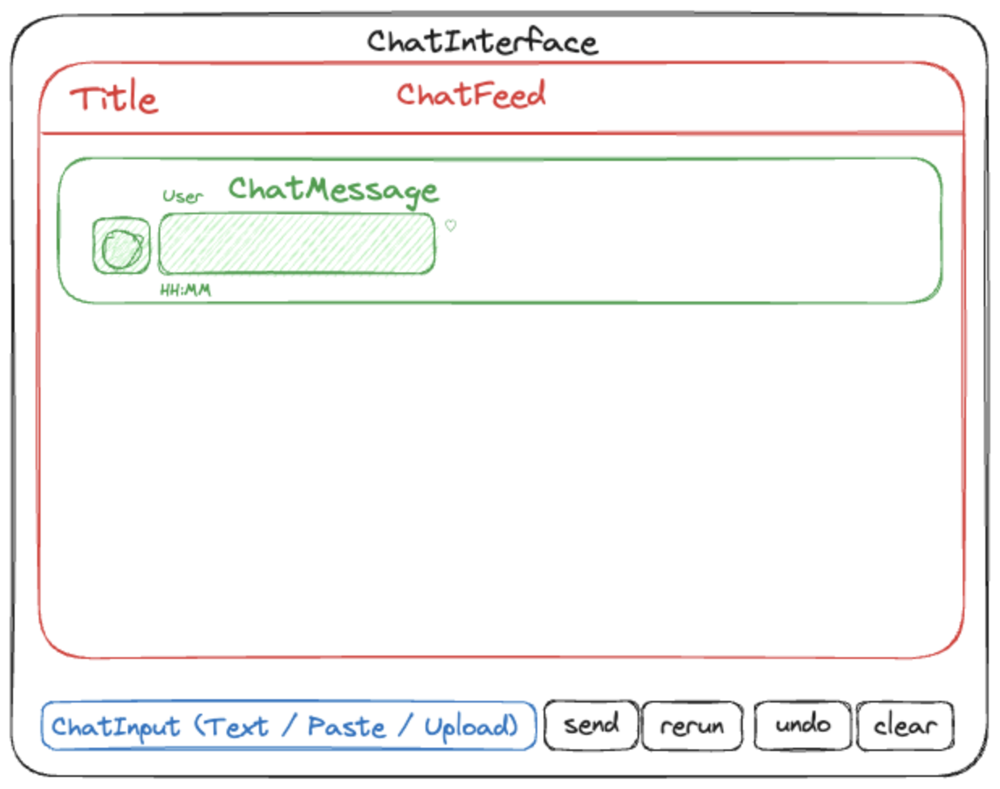
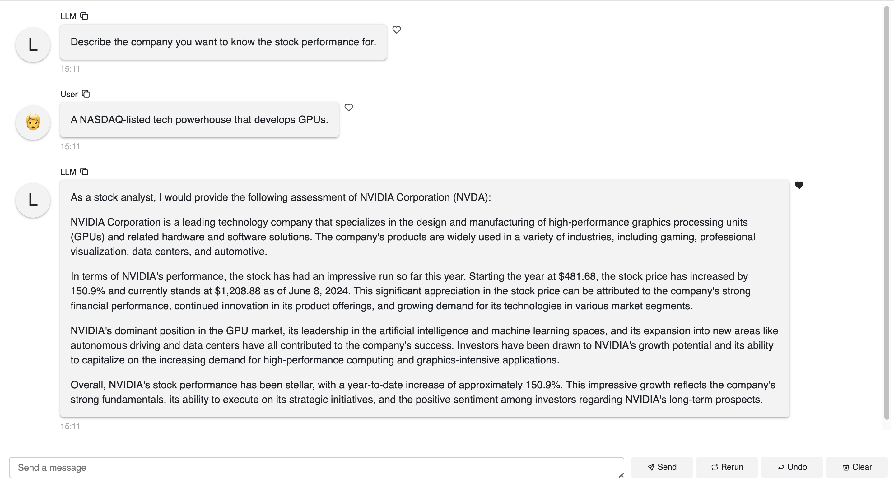

# StockGuru - stock performance chatbot app

## Overview:

- Description: A stock chatbot powered by Claude, capable of retrieving stock tickers, opening and closing prices within specified time frames, and providing personalized investment analysis.
- Chat interface layout:
  
- Chat demo:
  

## Setup:

1. (For project isolation) create & activate a virtual environment (dependencies are installed within the virtual environment other than system-wide & all subsequent steps will be performed within the virtual environment):
   ```
   python -m venv .venv
   source .venv/bin/activate
   ```
2. Upgrade the pip package manager to the latest version within the current Python environment: `python -m pip install --upgrade pip`
3. Install libraries and packages:
   - Install the yfinance Python package to access market data from Yahoo Finance's API: `pip install yfinance`
   - Install the Anthropic Python client library to interact with its AI models,: `pip install anthropic`
   - Install the Panel library to easily build powerful tools, dashboards and complex applications entirely in Python: `pip install panel`
   - Or simply install them together: `pip install yfinance anthropic panel`
4. Install Python dependencies listed in a `requirements.txt` file: `pip install -r requirements.txt`
5. (If necessary) Update the `requirements.txt` file: `pip freeze > requirements.txt`, so others can install all the packages and their respective versions specified in the `requirements.txt` file.
6. Run the app: `python stock_guru.py`

## Resources:

1. [Get up and running with the OpenAI API](https://platform.openai.com/docs/quickstart)
2. [Anthropic | Build API with Claude](https://www.anthropic.com/)
3. [Getting access to Claude](https://docs.anthropic.com/en/docs/getting-access-to-claude)
4. [Anthropic | Tool use (function calling)](https://docs.anthropic.com/en/docs/tool-use)
5. [Panel | Component Gallery > ChatInterface](https://panel.holoviz.org/reference/index.html)
